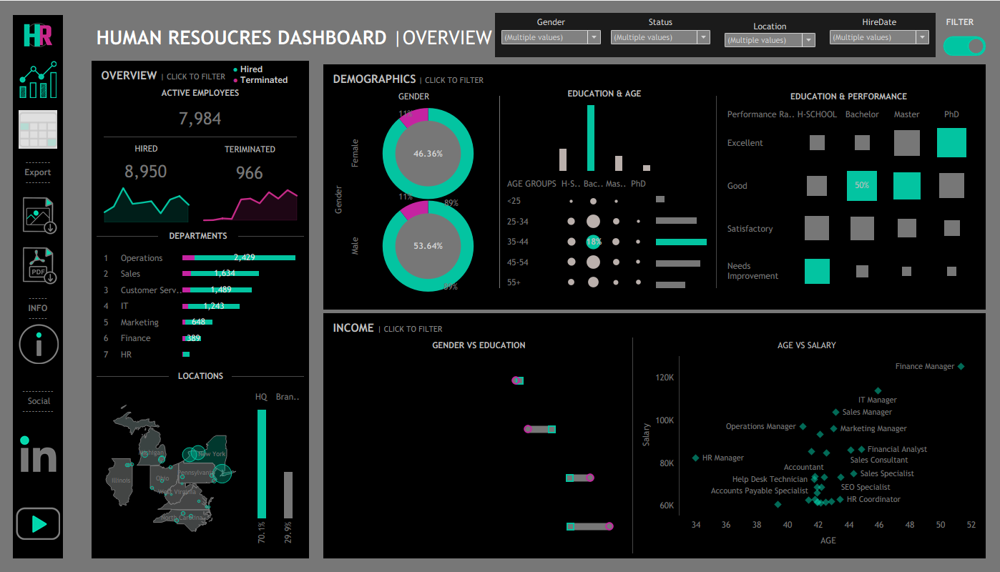

# 📊 Human Resources Dashboard

An interactive HR analytics dashboard designed to visualize key workforce metrics such as hiring trends, employee demographics, performance, and salary distribution. It enables data-driven decision-making for effective HR management.

---

## 🚀 Features

- 📈 Overview of active employees, hiring, and termination trends  
- 👥 Demographics analysis (gender, age, education)  
- 🏢 Department-wise employee distribution  
- 🌍 Location-based workforce insights  
- 💰 Salary analysis (age vs salary, roles)  
- ⭐ Performance evaluation across education levels  
- 🎛️ Interactive filters for dynamic exploration  

---

## 🛠️ Tech Stack

- Power BI / Tableau  
- Data Visualization  
- Data Cleaning & Transformation  

---

## 📊 Dashboard Preview

---

## 📌 Use Cases

- Workforce planning  
- HR performance tracking  
- Salary and compensation analysis  
- Diversity insights  

---

## ⚙️ How to Use

1. Open the dashboard file  
2. Apply filters to explore data  
3. Analyze insights across HR metrics  

---

## 📈 Outcome

- Improved workforce visibility  
- Data-driven HR decisions  
- Simplified reporting through interactive visuals  
